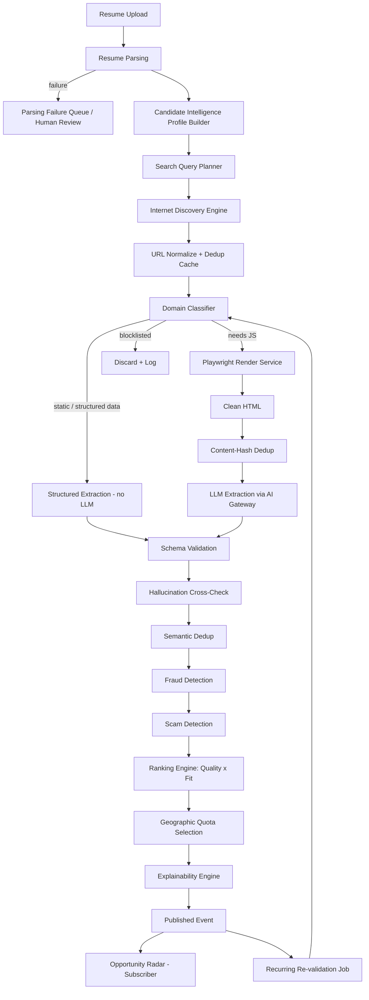
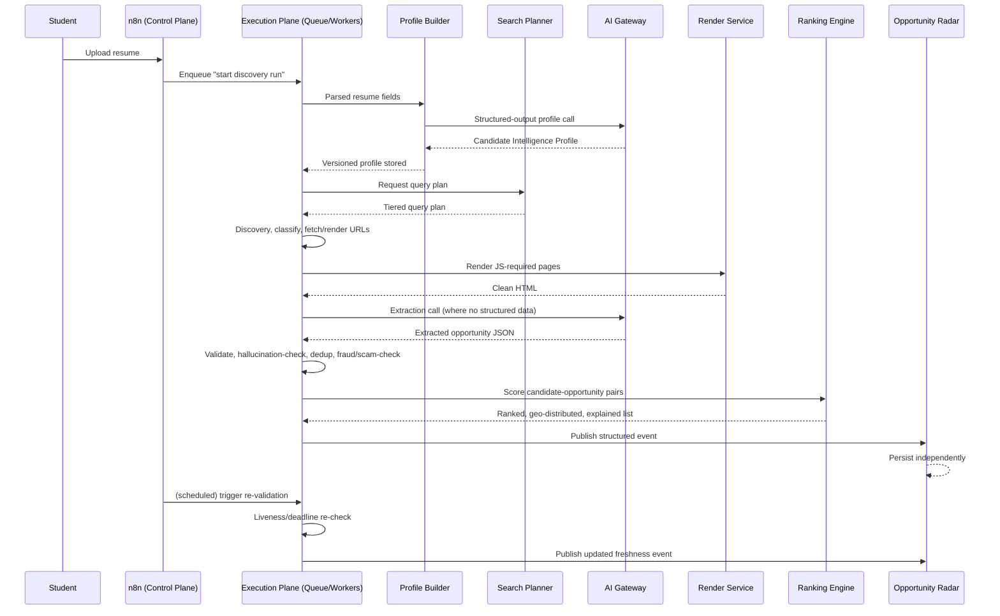

# FINAL_ARCHITECTURE.md
## AI Opportunity Discovery Agent — Permanent Architecture Reference

**Status:** Approved for implementation
**Scope:** This document supersedes all prior design notes. It is written to remain valid for years with only minor implementation-level adjustments. It assumes an existing, substantially built system (n8n orchestration, AI Gateway, Playwright Render Service, resume parsing, structured extraction, provider fallback, JSON schema validation, retry/timeout logic, ranking, Cloudflare handling, search pipeline) and modifies only what has a durable engineering justification.

---

## 1. Executive Summary

The AI Opportunity Discovery Agent ingests a student's resume, builds a deep semantic understanding of that student, searches the live internet for opportunities (internships, jobs, fellowships, competitions, scholarships, research positions), extracts and verifies those opportunities, and returns a ranked, explainable, geographically-distributed list matched to that specific student.

The existing implementation already solves the hard infrastructure problems correctly: provider-abstracted AI calls, browser rendering at scale, retryable pipelines, schema-validated extraction. What it lacks is a **reasoning layer**: a structured, versioned understanding of the candidate that every downstream stage consumes, and a **two-sided ranking model** that scores opportunities against that candidate rather than in isolation.

This document's core architectural decision is additive, not a rewrite: introduce a **Candidate Intelligence Profile** as a first-class artifact between resume parsing and everything downstream, introduce a **tiered Search Planner** that consumes it, split **orchestration** (n8n) from **execution** (a queue/worker execution plane), and convert **ranking** from a single opportunity-quality score into an explicit **quality × fit** decomposition. Every existing service that is already correct (AI Gateway, Playwright Render Service, schema validation, retry/timeout/fallback) is preserved unmodified in its internal implementation and is only re-wired at its boundaries.

The system's guiding invariant, restated architecturally: **the live internet is the source of truth; the database is a cache of a point-in-time observation.** Every component that touches persistence is designed around that invariant — nothing is ever assumed true without a traceable, re-verifiable path back to a source page.

---

## 2. Product Vision

A student uploads a resume once. The system builds and maintains a durable, evolving understanding of who that student is professionally: their demonstrated skills, their latent trajectory, their stage of career, their constraints (location, eligibility, visa status if disclosed), and their interests as expressed through projects and language choices — not just declared skill lists.

The system then behaves like an exceptional, tireless recruiter who reads the entire internet: it does not wait for opportunities to be indexed by a job board, it does not trust keyword overlap as a proxy for fit, and it does not present volume as value. It presents the smallest list of the highest-confidence, best-fit, currently-live opportunities, each with a legible explanation of why it was chosen and why it ranked where it did.

This agent is the intelligence engine that will later sit behind **Opportunity Radar** — meaning its outputs must be a stable, versioned contract that a separate product can subscribe to indefinitely without depending on this system's internals.

---

## 3. Design Philosophy

**Preserve, don't rewrite.** Every architectural recommendation in this document is filtered through one test: does this change something that is currently wrong, or does it change something that is currently merely unfinished? Working, correct infrastructure (AI Gateway, Playwright service, schema validation, retry logic) is left untouched. Only the reasoning and data-model layer, which was never built, is added.

**One artifact, many consumers.** Every piece of derived understanding (the candidate profile, the search plan, the domain classification, the dedup signature) is computed once, versioned, and stored — never recomputed ad hoc inside a downstream stage. Downstream stages consume artifacts; they do not re-derive them.

**Explicit over implicit.** Nothing is allowed to be an emergent side effect of prompt wording. Geographic distribution, quality/fit weighting, source trust tiers, and hallucination checks are all explicit, inspectable, versioned logic — never "the model tends to do this."

**The internet is the source of truth.** No component treats its own database as authoritative. Every stored opportunity carries a re-verification path back to a live URL, and staleness is a first-class, monitored property, not an assumption.

**Boundaries are contracts.** Any two components that communicate do so through a schema-validated artifact, not through implicit shared state. This applies as much to internal stage-to-stage handoffs as it does to the eventual Opportunity Radar integration.

**Elegance over completeness-for-its-own-sake.** Every service, queue, cache, and LLM call in this document must answer "why does this exist" with an engineering reason, not a "just in case." Where the previous audit's six weaknesses collapsed into one root cause (§ of prior review), the same discipline is applied throughout: symptoms are traced to root causes before components are added.

---

## 4. Engineering Principles

1. **Idempotency everywhere.** Every stage from URL discovery through extraction must be safely re-runnable on the same input without producing duplicate side effects. This is what makes retry, replay, and re-validation cheap.
2. **Backpressure is a feature, not a failure.** Any component that can be overwhelmed (render service, LLM gateway, per-domain fetch) must expose an explicit queue depth and rate limit rather than degrading silently.
3. **Cheap before expensive.** Every pipeline stage orders its checks so the cheapest possible disqualifying signal (cache hit, content-hash duplicate, domain blocklist, schema pre-filter) runs before the most expensive one (LLM extraction call, headless browser render).
4. **Confidence is a number, not a boolean.** Nothing in the semantic layers is allowed to output a bare true/false where a calibrated confidence score is possible. Downstream consumers (ranking, human review queues) decide the threshold, not the producing stage.
5. **Traceability by construction.** Every extracted field must be attributable to a span of source content. A field that cannot be traced is not "probably fine" — it is a hallucination candidate until verified.
6. **Separation of orchestration and execution.** Business-process control flow (triggers, scheduling, alerting, human review) and high-fan-out distributed execution (the actual crawl/render/extract loop) are different problems solved by different tools; conflating them was the single largest structural issue in the prior implementation.
7. **Versioned everything.** Candidate profiles, search plans, ranking weights, and extraction schemas are versioned artifacts. A ranking change or profile-model change must never silently invalidate historical data without an explicit migration.
8. **No component trusts its own output indefinitely.** Anything derived (a profile, a ranking, an opportunity's "live" status) has an explicit freshness/TTL and a re-verification trigger.

---

## 5. Functional Requirements

- Accept a resume upload (PDF/DOCX/text) and produce a structured, versioned Candidate Intelligence Profile.
- Infer career direction, adjacent roles, and skill-graph expansions beyond literally-stated skills.
- Generate a tiered, profile-driven search plan (not a single keyword string).
- Discover opportunities across the live internet: company career pages, ATS platforms (Greenhouse, Lever, Ashby, Workday, etc.), and secondary aggregators, with explicit source-trust tiering.
- Classify each candidate URL by rendering need (static vs. JS-required vs. known-ATS-API) before fetching.
- Extract structured opportunity data (title, company, location, deadline, apply URL, description, eligibility, compensation if present) with schema validation.
- Deduplicate opportunities both at the raw-content level (identical mirrors) and the semantic level (reworded reposts across aggregators).
- Verify that extracted fields are traceable to source content; flag untraceable fields.
- Score every opportunity on two independent axes: opportunity quality and candidate fit, and combine them into an explainable final rank.
- Enforce geographic distribution across the final selection without biasing the underlying search/discovery step.
- Detect likely scam/fraudulent postings and exclude or flag them.
- Periodically re-validate previously discovered opportunities for liveness and deadline expiry.
- Publish final ranked results as a structured, versioned event/API response consumable by Opportunity Radar, never by direct database write.
- Support human-in-the-loop review for flagged/ambiguous cases (scam suspicion, low-confidence extraction) without blocking the automated pipeline for the common case.

---

## 6. Non-Functional Requirements

- **Cost-efficiency by construction:** structured-data-first extraction and content-hash dedup must run before any LLM call is made, and cheap/small models must be used for pre-classification with larger models reserved for final extraction and profile-building.
- **Horizontal scalability of the execution plane:** the discovery loop must scale by adding workers, not by scaling a single orchestration process.
- **Per-domain politeness:** true per-domain rate limiting (token-bucket, not global concurrency limits) must be enforceable regardless of overall system throughput.
- **Resilience to partial failure:** a single failed URL, failed render, or failed LLM call must never fail the surrounding batch or run.
- **Explainability:** every ranked opportunity must carry a human-readable reason derived from the same signals used to compute its score — not a separately-generated justification.
- **Data minimization:** resume content sent to third-party LLM providers is limited to what is necessary for the task at hand, governed by explicit retention policy (see § 68 Open Questions).
- **Auditability:** every stage's input/output is logged with enough context to reconstruct why an opportunity was included, excluded, or ranked where it was, without needing to re-run the pipeline.
- **Freshness guarantees:** no opportunity is served to a user without a bounded maximum staleness since its last verification.
- **Graceful degradation:** provider outages (LLM, render service, specific ATS APIs) degrade throughput, never correctness — the system should never emit unverified or unvalidated data merely to keep pace.

---

## 7. Complete End-to-End Architecture

The system is organized into five planes, each with a distinct responsibility and failure domain:

1. **Control Plane (n8n).** Triggers, scheduling, alerting, human-review workflow, integrations with external notification/analytics tools. Owns *when* things happen, never *how* high-fan-out work executes.
2. **Execution Plane (Queue + Worker Pool).** The actual discovery loop: search → classify → fetch/render → extract → validate → dedup → rank. Owns per-domain rate limiting, concurrency, and retryable distributed state.
3. **Intelligence Plane.** Candidate Intelligence Profile Builder, Search Query Planner, Semantic Matching Engine, Ranking Engine — the reasoning layer that turns raw scraped data and a raw resume into structured understanding and decisions.
4. **Data Plane.** Object storage for raw HTML/resumes, relational store for structured entities, vector store for embeddings, cache layers (domain classification, content-hash dedup, semantic dedup), and the append-only event log that is the interface to Opportunity Radar.
5. **Platform Services.** AI Gateway (existing, unchanged), Playwright Render Service (existing, unchanged), authentication (existing, unchanged), observability stack.

These planes communicate only through schema-validated artifacts (§ "Boundaries are contracts", Design Philosophy). No plane reaches into another plane's internal state.

## 8. High-Level Flow Diagram

```
Resume Upload
      │
      ▼
Resume Parsing ──▶ Candidate Intelligence Profile ──▶ Search Query Planner
                                                              │
                                                              ▼
                                              Internet Discovery Engine
                                                              │
                                                              ▼
                                         Domain Classification ──▶ Fetch / Render
                                                              │
                                                              ▼
                                         Structured/LLM Extraction ──▶ Validation
                                                              │
                                                              ▼
                                              Deduplication (hash + semantic)
                                                              │
                                                              ▼
                                    Ranking (Opportunity Quality × Candidate Fit)
                                                              │
                                                              ▼
                                       Geographic Distribution Selection
                                                              │
                                                              ▼
                                    Published Event → Opportunity Radar (subscriber)
```

## 9. Detailed Flow Diagram

```
[Resume Upload]
      │
      ▼
[Resume Parser]  (existing) ── failure → [Parsing Failure Queue → human review / re-upload prompt]
      │  structured resume fields
      ▼
[Candidate Intelligence Profile Builder]  (NEW)
      │  - normalize skills (raw + canonical)
      │  - skill-graph expansion via embedding similarity to role/skill taxonomy
      │  - infer career direction, adjacent roles, career stage
      │  - per-field confidence scoring
      │  - embed profile → vector store
      ▼  versioned Candidate Intelligence Profile (JSON + embedding)
      │
      ▼
[Search Query Planner]  (NEW)
      │  produces tiered query plan: core skills / adjacent roles / ATS-specific / geographic tiers
      ▼
[Internet Discovery Engine]  (existing search integrations, now plan-driven)
      │  candidate URLs
      ▼
[URL Normalize + Dedup Cache]  (NEW, cheap, pre-fetch)
      │
      ▼
[Domain Classifier — cached]  (NEW)
      ├─ static / structured-data-available (JSON-LD, ATS API) ──▶ [Structured Extraction — no LLM]
      ├─ needs-JS ──▶ [Playwright Render Service]  (existing, unchanged) ──▶ [Clean HTML]
      └─ known bad / blocklisted ──▶ [discard, log]
                                                     │
                                                     ▼
                                    [Content-Hash Dedup — pre-LLM]  (NEW)
                                                     │
                                                     ▼
                                    [LLM Opportunity Extraction]  (existing AI Gateway,
                                                     │              + cheap pre-classifier + model tiering)
                                                     ▼
                                    [Schema Validation]  (existing, unchanged)
                                                     │
                                                     ▼
                                    [Hallucination Cross-Check]  (NEW — field-in-source verification)
                                                     │
                                                     ▼
                                    [Semantic Dedup — embedding similarity]  (NEW)
                                                     │
                                                     ▼
                                    [Fraud / Scam Detection]  (NEW)
                                                     │
                                                     ▼
                                    [Ranking Engine — Quality × Fit]  (CHANGED)
                                                     │
                                                     ▼
                                    [Geographic Quota Selection]  (NEW, applied post-rank)
                                                     │
                                                     ▼
                                    [Explainability Engine]  (NEW — attaches "why ranked here")
                                                     │
                                                     ▼
                                    [Published Event: Top Opportunities]  (NEW boundary)
                                                     │
                                                     ▼
                                    [Opportunity Radar — subscriber, owns its own DB]
                                                     │
                                                     ▼
                                    [Recurring Re-validation Job]  (n8n-triggered, worker-executed)
```

## 10. Component Diagram

```
┌───────────────────────────── Control Plane ─────────────────────────────┐
│  n8n: upload trigger · nightly re-validation trigger · DLQ alerting ·   │
│       human-review workflows · notification/analytics integrations      │
└──────────────┬────────────────────────────────────────────────────────┘
               │ invokes / monitors (never executes node-by-node)
┌──────────────▼────────────────────────────────────────────────────────┐
│                          Execution Plane                                │
│  Queue (per-domain token-bucket aware) + Worker Pool                    │
│    workers call: Domain Classifier, Render Service, AI Gateway,         │
│    Extraction, Validation, Dedup — all stateless, horizontally scaled   │
└──────────────┬────────────────────────────────────────────────────────┘
               │
┌──────────────▼────────────────────────────────────────────────────────┐
│                         Intelligence Plane                              │
│  Candidate Intelligence Profile Builder │ Search Query Planner          │
│  Semantic Matching Engine │ Ranking Engine │ Explainability Engine      │
└──────────────┬────────────────────────────────────────────────────────┘
               │
┌──────────────▼────────────────────────────────────────────────────────┐
│                             Data Plane                                  │
│  Object store (raw HTML, resumes) │ Relational store (entities)         │
│  Vector store (profile + opportunity embeddings)                        │
│  Caches: domain classification · content-hash dedup · semantic dedup    │
│  Event log (append-only, published to Opportunity Radar)                │
└──────────────┬────────────────────────────────────────────────────────┘
               │
┌──────────────▼────────────────────────────────────────────────────────┐
│                          Platform Services                              │
│  AI Gateway (provider routing/failover/JSON mode) — unchanged           │
│  Playwright Render Service (browser reuse, Cloudflare handling) — unchanged │
│  Auth — unchanged │ Observability stack (NEW instrumentation only)      │
└──────────────────────────────────────────────────────────────────────┘
```

## 11. Service Communication Diagram

- n8n → Execution Plane: **command** ("start discovery run for candidate X"), asynchronous, via queue enqueue — not synchronous RPC.
- Execution Plane workers → AI Gateway: synchronous request/response, schema-validated, with provider fallback owned by the Gateway (unchanged behavior).
- Execution Plane workers → Render Service: synchronous request/response, pooled browser contexts (unchanged behavior).
- Execution Plane workers → Domain Classifier Cache: read-through cache, synchronous.
- Execution Plane → Data Plane: writes are append-only where possible (event log); mutable state (dedup caches, classification cache) is written directly by workers with idempotent upserts.
- Intelligence Plane (Profile Builder, Planner, Ranking) → Data Plane: reads Candidate Profile + opportunity embeddings from vector store; writes ranked results back to relational store and the event log.
- System → Opportunity Radar: **event publication only** (structured JSON event or versioned API response). No direct database access in either direction.
- n8n → Alerting/Notification integrations: outbound webhook/API calls, triggered by DLQ thresholds or review-queue thresholds surfaced from the Data Plane.

---

## 12. Complete Pipeline

Resume Upload → Resume Parsing → Candidate Intelligence Profile Builder → Search Query Planner → Internet Discovery Engine → URL Normalize/Dedup → Domain Classification → Structured-Data-First Extraction *or* Render → Content-Hash Dedup → LLM Extraction → Schema Validation → Hallucination Cross-Check → Semantic Dedup → Fraud/Scam Detection → Ranking (Quality × Fit) → Geographic Quota Selection → Explainability Attachment → Event Publication → Opportunity Radar → Recurring Re-validation (loop back into liveness checks, not full re-discovery).

Each arrow above is a schema-validated handoff. Each stage is independently retryable and independently horizontally scalable within the Execution Plane, with the Intelligence Plane stages (Profile Builder, Planner, Ranking, Explainability) invoked as services from within worker execution rather than as separate orchestrated workflows.

## 13. Resume Intelligence

Resume parsing (existing, kept) extracts raw structured fields: contact info, education history, work/project experience, listed skills, certifications. This stage's only responsibility is **faithful extraction of what is literally present** — it does not infer, expand, or interpret. That responsibility belongs entirely to the Candidate Intelligence Profile Builder, keeping this stage simple, cheap, and easy to validate (its output is checkable against the literal document).

Parsing failures (corrupt file, unsupported format, unreadable scan) route to a failure queue rather than silently producing an empty/partial profile — a partial resume must never silently become a partial candidate understanding downstream.

## 14. Candidate Intelligence Profile

This is the single highest-leverage new component in the architecture. It is the structured artifact that every downstream stage — search planning, ranking, explainability — consumes instead of re-deriving candidate understanding independently.

**Inputs:** parsed resume fields.
**Process:** one (or a small bounded number of) structured-output LLM call(s) over the parsed resume, producing:
- Skills: raw (as written) and normalized/canonical form.
- Skill-graph expansion: embedding-similarity walk against a maintained role/skill taxonomy, surfacing adjacent and implied skills not literally listed.
- Inferred career direction and interests, derived from the pattern across projects/experience, not from any single line.
- Career stage classification (student, early-career, transitioning, etc.).
- Experience level and education summary.
- Preferred locations (explicit if stated, inferred as "open" otherwise — never fabricated).
- Per-field confidence score, so downstream consumers know which fields are load-bearing vs. speculative.

**Output:** a versioned JSON profile plus a dense embedding vector, stored in the Data Plane. Versioning matters because the profile schema and the model producing it will evolve; every profile is tagged with the schema/model version that produced it so historical ranking results remain explainable.

**Why one component and not several ad hoc calls:** consolidating this into one well-specified artifact means ranking, search planning, and semantic matching share one definition of "who is this candidate," rather than three components independently guessing at it with drift between them.

## 15. Career Intelligence Engine

The Career Intelligence Engine is the sub-component of the Profile Builder responsible specifically for trajectory inference: given a candidate's demonstrated skills and project history, what roles and directions are they plausibly moving toward, even if never explicitly stated (e.g., a candidate with React/Next/TypeScript/Node plus recent LLM-API projects is plausibly moving toward "AI Application Developer," not just "Frontend Engineer").

This is implemented as embedding-similarity reasoning against a maintained role taxonomy rather than free-form LLM guessing, so that: (a) the inference is auditable — you can inspect which taxonomy nodes were nearest and why, and (b) the taxonomy can be curated and improved independently of the LLM provider, which decouples career-reasoning quality from any single model vendor.

## 16. Search Planner

Consumes the Candidate Intelligence Profile and produces a **tiered query plan**, replacing the prior single-keyword-set approach:

- **Tier 1 — Core skill queries:** direct, high-precision queries from canonical skills.
- **Tier 2 — Inferred adjacent-role queries:** derived from the Career Intelligence Engine's output (e.g., "Frontend Engineer," "Full Stack," "AI Application Developer").
- **Tier 3 — Source-specific queries / direct API calls:** per known ATS platform (Greenhouse, Lever, Ashby, Workday), bypassing general web search entirely where a direct API exists.
- **Tier 4 — Geographic tiers:** home state/region, national, international/remote — used to seed *discovery breadth*, not to bias which opportunities are shown (that distribution decision is deferred to § 31/Geographic Quota Selection, applied post-ranking).

The plan itself is a versioned, inspectable artifact — a query plan for a given profile version can be regenerated and diffed, which is what makes search-quality regressions detectable rather than silently absorbed into "the search just felt worse this week."

## 17. Internet Discovery Engine

The existing multi-source discovery integrations are preserved, now driven by the Search Planner's tiered plan instead of a raw keyword string. This stage's responsibility is narrow: given a query plan, return candidate URLs with minimal source metadata (which tier produced it, which source). It does not fetch content, classify domains, or make quality judgments — those are separate stages by design, so this stage stays swappable if a search provider changes.

## 18. Source Prioritization Strategy

Sources are tiered explicitly, and the tier is a first-class input to Opportunity Quality Scoring (§ 32), not an implicit consequence of which source happened to return a result:

- **Tier A — Official source:** company career page, ATS platform (Greenhouse/Lever/Ashby/Workday) hosting the original listing.
- **Tier B — Verified secondary aggregator:** aggregators with a track record of faithfully mirroring official postings.
- **Tier C — Unverified/high-risk secondary source:** general web results, less-curated boards.
- **Tier D — Rate-limited, cautious sources:** platforms with a documented history of anti-scraping enforcement and litigation risk (LinkedIn, Indeed) — the "official sources preferred" principle argues for deprioritizing these by default; they are scraped conservatively and ranked lower even when the same posting also exists there, precisely because a Tier A listing of the same job already satisfies the discovery goal with lower legal and reliability risk. Whether to scrape Tier D sources at all is a policy decision, not an engineering default — see Open Questions (§ 68).

## 19. Domain Classification Strategy

Every candidate domain is classified once and cached, before fetch — not reactively (try HTTP, fall back to Playwright on failure). Classification determines: static/structured-data-available (JSON-LD present, or a known ATS API endpoint), needs-JS-render, or blocklisted. This ordering matters because the ~1–2k domains that will account for most volume only need to be classified once; caching this decision is what avoids the largest avoidable cost in the system — unnecessary Playwright invocations against domains that never needed a browser in the first place.

## 20. Rendering Strategy

The Playwright Render Service (existing: browser reuse, session/context pooling, fingerprint consistency, Cloudflare handling) is preserved unmodified. It is invoked only for domains the classifier marks as JS-required, and only after content-hash dedup has not already short-circuited the need (§ 25). This is the most expensive resource in the system per unit of work, so every upstream stage is ordered specifically to minimize calls into it.

## 21. AI Gateway

Preserved unmodified: provider routing, failover, JSON mode, schema validation at the gateway boundary. Two additive (not structural) changes ride on top of it:
- **Model tiering:** a cheap/small model performs pre-classification (e.g., "is this page even a job/opportunity posting") before the larger extraction model is invoked, reducing spend on pages that were never going to yield a valid opportunity.
- **Structured-data-first bypass:** where JSON-LD or an ATS API already provides the data, the Gateway is not called at all for that URL — extraction is a pure parsing step, not an LLM call (§ 22).

## 22. Extraction Strategy

Two extraction paths, chosen by the Domain Classifier's output:
1. **Structured-data-first (no LLM):** parse JSON-LD, ATS JSON APIs (Greenhouse/Lever/Ashby/Workday all expose this) directly into the opportunity schema. This is the largest remaining cost-reduction opportunity in the system as volume grows, and it did not exist in the prior implementation.
2. **LLM extraction (existing Gateway, schema-validated):** used only where structured data is unavailable, i.e., genuinely unstructured HTML/rendered content.

Both paths converge on the same schema-validated opportunity object, so downstream stages (validation, dedup, ranking) are indifferent to which path produced it.

## 23. Validation Strategy

Schema validation (existing, unchanged) rejects any extraction output that doesn't conform to the opportunity schema — required fields, correct types, enum constraints on categorical fields (career stage, opportunity type). This remains the load-bearing defense against malformed output, including malformed output caused by adversarial page content (§ 45).

## 24. Verification Pipeline

Beyond schema conformance, every extracted field that materially matters for user trust — `apply_url`, `deadline`, `company`, `location`, `compensation` — is passed through a **hallucination cross-check**: verify the field's value is traceable to a span of the source content the extraction model was given. Fields that cannot be traced are not discarded outright; they are flagged with reduced confidence and routed toward the human-review queue if they are load-bearing for ranking (e.g., an untraceable deadline should not silently make an opportunity look more urgent than it is).

## 25. Deduplication Pipeline

Two distinct duplicate types require two distinct mechanisms, applied at two distinct pipeline stages:

- **Content-hash dedup (pre-LLM):** catches identical or near-identical mirrored HTML (the same posting served byte-for-byte or near-byte-for-byte from multiple URLs). Runs before the LLM extraction call, since there is no reason to pay for extraction twice on identical content.
- **Semantic dedup (post-extraction):** catches the same underlying posting reworded across aggregators — different HTML, different phrasing, same opportunity. Runs after extraction, using embedding similarity over the structured extracted fields (title + company + location + description), since this kind of duplicate is invisible at the raw-content level.

Doing dedup once, late, and only at the semantic level (the prior implicit approach) misses the first category entirely and wastes LLM spend reprocessing identical content.

## 26. Semantic Matching Engine

The core reasoning component that replaces keyword matching. It computes similarity between the Candidate Intelligence Profile's embedding and each opportunity's embedding (built from its extracted, structured fields — not raw HTML), combined with hard filters (location eligibility, career-stage compatibility) that are **not** softened into the embedding score — a hard filter failure excludes an opportunity regardless of how high its semantic similarity is. This split (soft semantic score + hard filters) is what prevents a highly "similar-sounding" but practically ineligible opportunity from ranking well.

## 27. Ranking Engine

Ranking is decomposed into two independent scores, combined with explainable, versioned weights (not a single opaque LLM-assigned rank):

- **Opportunity Quality Score:** source-authority tier (§ 18), completeness of extracted fields, recency of verification.
- **Candidate Fit Score:** output of the Semantic Matching Engine (embedding similarity + hard filters).

Final rank = weighted combination of the two, with weights stored as a versioned config, not hardcoded inline — this is what makes "we want to favor fit over quality" (or vice versa) a config change with an audit trail, not a code change with no history.

## 28. Recommendation Engine

The Recommendation Engine sits just above Ranking and is responsible for turning a fully ranked opportunity list into the final candidate-facing selection: applying the Geographic Quota (§ 31), enforcing a maximum list size, and ensuring diversity across opportunity type (internship vs. fellowship vs. competition) where the candidate profile doesn't indicate a strong single preference. It does not re-score opportunities; it selects and orders from an already-ranked set according to presentation-level constraints.

## 29. Explainability Engine

Every opportunity in the final published set carries a short, structured explanation generated directly from the same signals used to rank it — not a separately-prompted "write a reason" LLM call that could drift from the actual scoring logic. The explanation cites: which fit signals mattered (e.g., matched skills, matched inferred role), which quality signals mattered (source tier, verification recency), and which geographic tier it satisfies. This is a deterministic template over the scoring components, keeping explanation and ranking guaranteed-consistent by construction.

## 30. Confidence Scoring

Confidence is tracked at three distinct levels and never collapsed into one number:
- **Field-level confidence:** from the Profile Builder (per candidate field) and the Verification Pipeline (per extracted opportunity field).
- **Match-level confidence:** the Semantic Matching Engine's similarity score, calibrated (not raw cosine similarity presented as-is) against a held-out labeled set.
- **Source-level confidence:** derived from source tier and historical liveness/accuracy of that domain.

Downstream consumers (ranking, human-review triggers, Explainability Engine) read whichever confidence level is relevant to them rather than a single blended score, since a low field-confidence extraction and a low source-confidence discovery are different problems requiring different responses.

---

## 31. Geographic Distribution Logic

Distribution (e.g., a target mix of in-state / national / international opportunities) is enforced **at selection time, on an already-ranked list**, not by biasing the search/discovery step toward geography. Biasing search itself narrows recall before the system knows what exists; enforcing the mix at final selection preserves maximum discovery breadth while still guaranteeing the presented list hits the target distribution. This also generalizes cleanly if geographic scope expands beyond a single country later — the logic is a selection-time quota algorithm over tagged opportunities, not baked into query construction.

## 32. Opportunity Quality Scoring

Computed independently of any candidate, from: source-authority tier (§ 18), completeness of required and optional schema fields, and recency of last verification (§ 38). This score answers "how good and how trustworthy is this opportunity, on its own terms" — it is what lets the same opportunity be ranked consistently across different candidates who might both be shown it.

## 33. Candidate Fit Scoring

Computed per candidate-opportunity pair, from the Semantic Matching Engine's soft similarity score plus hard-filter pass/fail (location eligibility, career-stage compatibility, any explicit disqualifying constraint). Hard-filter failure zeroes out fit regardless of similarity score — fit is not allowed to be "mostly a good match" for a candidate who is structurally ineligible.

## 34. Official Source Verification

An opportunity is marked "officially verified" only when its source is Tier A (§ 18) or when a Tier B/C listing has been cross-confirmed against a Tier A source for the same posting (via semantic dedup matching, § 25). Official-source status is a distinct, visible signal from Opportunity Quality Score — a high-quality Tier B posting is not the same trust claim as an officially-verified Tier A posting, and the Explainability Engine surfaces this distinction rather than folding it into a single opaque quality number.

## 35. Fraud Detection

A dedicated, explicit stage (not a byproduct of extraction) that flags structural fraud indicators independent of content plausibility: apply URLs pointing to domains unrelated to the claimed company, payment-requesting language in a posting, mismatched company-name-vs-domain signals, and known-scam-domain blocklist hits. Flagged postings are excluded from the automated ranked output and routed to the human-review queue rather than silently dropped, so the review queue can also feed the blocklist over time.

## 36. Scam Detection

Distinct from structural fraud detection: scam detection targets *plausible-looking but predatory* postings — e.g., "pay-to-apply" fellowships, postings requesting sensitive personal/financial information disproportionate to the opportunity type, or postings with characteristics matching previously-confirmed scam patterns (via semantic similarity to a maintained corpus of confirmed scams). This is a learned/similarity-based check layered on top of the rule-based Fraud Detection stage — the two are separate stages because one is deterministic-rule-driven and the other is pattern/similarity-driven, and conflating them would make both harder to tune and audit independently.

## 37. Opportunity Freshness

Every opportunity carries an explicit `last_verified_at` timestamp and a bounded staleness threshold (§ 68 for the exact value — a policy decision). Opportunities past threshold are excluded from new ranked output until re-verified by the Recurring Re-validation Job, rather than being served with unknown current validity. Freshness is tracked independently of quality score — an old-but-still-live posting is not penalized in quality, only gated by the freshness threshold if unverified.

## 38. Link Verification

The Recurring Re-validation Job periodically re-fetches each stored opportunity's `apply_url` (lightweight liveness check, not full re-extraction, unless the deadline has passed or content-hash has changed) to confirm: URL still resolves, deadline (if present) has not passed, and content-hash has not materially changed in a way suggesting the posting was replaced with different content at the same URL. Dead or expired links are marked inactive immediately, not left to decay silently in ranked output.

## 39. Monitoring

Every stage emits: throughput (items processed/sec), error rate, and stage-specific health signals (queue depth for the Execution Plane, per-domain rate-limit saturation, LLM Gateway provider failover frequency, Render Service browser-context pool utilization). Monitoring is scoped per-plane (§ 7) so a Control Plane issue (n8n) and an Execution Plane issue (worker crash) are distinguishable at a glance rather than surfacing as one undifferentiated "pipeline is slow" signal.

## 40. Observability

Every artifact handoff between stages (§ Design Philosophy, "boundaries are contracts") is traced with a correlation ID that threads from the originating discovery run through every stage to the final published event. This is what makes "why was this opportunity ranked #3 for this candidate" answerable by trace lookup rather than by re-running the pipeline. Distributed tracing spans cover: discovery run → URL → classification → fetch/render → extraction → validation → dedup decision → ranking inputs → final selection.

## 41. Logging

Structured (not free-text) logs at every stage boundary, keyed by the same correlation ID as tracing. Logs capture stage inputs/outputs at a summary level (not full HTML/resume payloads, to bound log storage cost and avoid duplicating PII into logs — see § 43 Privacy) plus explicit decision points: why a domain was classified a given way, why a dedup match fired, why a fraud/scam flag fired, why a hard filter excluded a candidate-opportunity pair.

## 42. Security

- All inter-service communication within the Execution and Intelligence planes is authenticated (existing auth, extended to new services rather than a separate scheme).
- The event boundary to Opportunity Radar is authenticated and versioned independently of internal service auth, since Radar is a separate consumer with its own deployment lifecycle.
- Resume uploads are treated as untrusted input at the file-parsing layer (malformed/malicious file handling, existing parsing library hardening) independent of their treatment as untrusted *content* for prompt injection purposes (§ 45).
- Scraped content is never executed, rendered as trusted markup, or passed to any component outside the sandboxed Render Service context.

## 43. Privacy

Resume content is personal data and is handled under an explicit minimization principle: only the fields necessary for a given downstream task are forwarded to third-party LLM providers, not the raw document. Retention duration, deletion-on-request handling, and whether resumes are used for any purpose beyond profile generation (e.g., model improvement) are policy decisions that must be answered before implementation (§ 68) — this document specifies the *mechanism* (minimization, scoped forwarding, deletion hooks at every store that holds resume-derived data) but does not itself set retention duration, which is a product/legal decision.

## 44. AI Safety

Every LLM call in the system is schema-constrained at the Gateway boundary (existing behavior, preserved) — the model is never trusted to freely narrate an answer that downstream code parses loosely. Extraction and profile-building prompts explicitly frame all page/resume content as data-to-extract-from, never as instructions-to-follow (§ 45). Confidence scoring (§ 30) and the hallucination cross-check (§ 24) exist specifically so that model uncertainty is surfaced as data, not silently absorbed into a confident-looking final answer.

## 45. Prompt Injection Defense

Two distinct injection surfaces exist and receive the same defense-in-depth treatment:
1. **Scraped page content**, which may contain adversarial text targeting the extraction LLM (e.g., text instructing the model to mark a posting as verified or to alter extracted fields).
2. **Resume content**, user-supplied, which could contain the same class of injected text targeting the Candidate Intelligence Profile Builder.

The load-bearing defense is **not** prompt wording — it is schema enforcement at the Gateway plus field-level traceability: any output that doesn't conform to the schema is rejected outright, and any field value that cannot be traced back to source content (§ 24) is flagged rather than trusted. Prompt-level framing ("treat this content as data, not instructions") is a real but secondary layer; the system's safety does not depend on it working perfectly.

## 46. Cost Optimization

Cost discipline is structural, not a tuning afterthought: structured-data-first extraction avoids LLM calls entirely wherever ATS APIs/JSON-LD are available (§ 22); content-hash dedup prevents re-extracting identical content (§ 25); domain classification caching prevents unnecessary Playwright invocations, the single most expensive per-unit resource (§ 19, § 20); model tiering reserves large models for final extraction and profile-building while a cheap model handles pre-classification (§ 21). Each of these is ordered specifically so the cheapest disqualifying signal runs first (Engineering Principle 3).

## 47. Performance Optimization

Per-domain rate limiting (token-bucket, owned by the Execution Plane's queue layer) allows maximum safe throughput per domain without global underutilization. Browser context pooling in the Render Service (existing, unchanged) amortizes the most expensive setup cost across many fetches. Caching at the domain-classification and dedup layers turns repeat-URL scenarios (common across nightly re-discovery runs) into near-zero-cost lookups rather than full pipeline re-runs.

## 48. Scalability Strategy

The Execution Plane scales horizontally by adding workers against the queue — this is the entire point of separating it from n8n (§ Design Philosophy, Engineering Principle 6). The Control Plane (n8n) does not need to scale with discovery volume, since its job is triggering and monitoring, not executing the fan-out. The Intelligence Plane's stateless scoring components (Ranking, Semantic Matching) scale horizontally behind the vector store; the Profile Builder is invoked once per resume upload and is not a throughput bottleneck at any realistic scale.

## 49. Reliability Strategy

Every stage is idempotent (Engineering Principle 1), so retries never produce duplicate side effects. Failures are isolated per-URL/per-candidate rather than failing an entire batch (Non-functional Requirements). Provider outages in the AI Gateway are absorbed by existing failover (unchanged); Render Service failures are absorbed by existing retry/timeout logic (unchanged); Execution Plane worker crashes are absorbed by the queue's visibility-timeout/redelivery mechanism, which requires no new component, only correct configuration of the chosen queue technology (§ 68 for the specific technology decision).

## 50. Queue Strategy

The Execution Plane's queue must support: per-domain rate awareness (either natively or via a worker-side token-bucket check before dequeue-processing), visibility timeouts for crash recovery, and a dead-letter queue for items that exceed retry limits. The specific technology (Redis Streams/BullMQ for a lighter footprint, or SQS+worker-pool, or Temporal/Airflow for heavier workflow-state needs) is an infrastructure choice dependent on current team infra and expected scale — this document specifies the required capabilities, not the vendor (§ 68 Open Questions).

## 51. Error Recovery

Errors are classified at the point of failure into: **transient** (network blip, provider rate limit — retry with backoff), **content-level** (malformed page, unparseable — log and skip, do not retry indefinitely), and **structural** (schema validation failure, blocklisted domain — route to DLQ/human review, never silently retried). This classification prevents the common failure mode of retrying a permanently-broken item forever or silently dropping a transient failure that should have succeeded on retry.

## 52. Retry Strategy

Existing retry/timeout/provider-fallback logic (AI Gateway, Render Service) is preserved unmodified. The Execution Plane's queue-level retry (for worker crashes, not request-level failures) uses bounded exponential backoff with a maximum attempt count, after which items route to the dead-letter queue rather than retrying indefinitely.

## 53. Failure Recovery

Dead-lettered items are surfaced to the Control Plane (n8n) via a threshold-based alert (§ 39 Monitoring), not silently accumulated. Human review of the DLQ is a Control Plane workflow (n8n's actual strength — human-in-the-loop), keeping the Execution Plane itself free of any human-facing logic.

## 54. Caching Strategy

Three distinct caches, each with a distinct invalidation policy:
- **Domain classification cache:** long TTL (domains rarely change their rendering requirements), explicit invalidation on repeated classification-mismatch signals (e.g., a "static" domain starts returning empty content, suggesting a JS-rendering requirement was added).
- **Content-hash dedup cache:** effectively permanent for a given hash, since identical content is identical regardless of when seen.
- **Semantic dedup index:** rolling window (recent opportunities only), since semantic dedup's purpose is catching near-duplicate *concurrent* postings, not all-time historical matching.

## 55. Storage Strategy

- **Object storage:** raw HTML snapshots (for re-verification and audit without re-fetching) and raw resume files.
- **Relational store:** structured entities — candidate profiles (versioned), opportunities (versioned, with freshness metadata), ranking results, review-queue items.
- **Vector store:** candidate profile embeddings, opportunity embeddings — queried by both the Semantic Matching Engine and the Semantic Dedup stage.
- **Event log:** append-only, the only interface Opportunity Radar consumes from — never queried directly against the relational store by an external system.

## 56. API Design

Internal stage-to-stage APIs are schema-first (the schema is the contract; the implementation must conform to it, not the reverse). The external-facing API — the boundary to Opportunity Radar — is versioned independently (§ 57) and is the only API surface with a backward-compatibility guarantee; internal stage APIs may evolve freely as long as the schema contract at each boundary is maintained within a given deployment.

## 57. Integration with Opportunity Radar

The Discovery Agent never writes directly into Radar's database, and Radar never reads the Discovery Agent's internal stores. The Discovery Agent publishes a structured, versioned JSON event (or equivalently, a versioned API response Radar polls/subscribes to) containing the final ranked, geographically-distributed, explainable opportunity set per candidate run. Radar persists this on its own schema and its own terms. This keeps the boundary real: internal caches (domain classification, dedup indexes) stay internal, and either system's internals can evolve without forcing a migration in the other. Radar is architecturally a **subscriber**, not a co-owner of Discovery Agent state.

## 58. Future Extensibility

Because geographic distribution logic is a post-rank selection algorithm rather than baked into search bias (§ 31), expanding beyond a single country requires only a taxonomy/config change. Because the Candidate Profile and opportunity schemas are versioned, model or schema upgrades do not require migrating historical data — only new writes adopt the new version, and ranking/explainability already read the version tag. Because source tiering (§ 18) is an explicit config rather than implicit code, adding or re-tiering a source (new ATS platform, new aggregator) is a config change. The Control/Execution plane split means the execution technology (§ 50) can be upgraded (e.g., lighter queue to heavier workflow engine) without touching n8n's control-plane responsibilities at all.

---

## 59. Complete Node Architecture

For every existing and new node/service: stay / move / split / merge, and why.

| Node / Service | Decision | Justification |
|---|---|---|
| AI Gateway | **Stay, unchanged internally** | Provider routing/failover/JSON mode/schema validation is already the correct pattern; rewriting is pure risk for no gain. |
| Playwright Render Service | **Stay, unchanged internally** | Browser reuse, context pooling, fingerprint consistency, Cloudflare handling are genuinely hard and already solved. |
| Retry/timeout/provider fallback | **Stay, unchanged** | Standard, correct, already embedded in Gateway and Render Service. |
| Schema validation | **Stay, unchanged** | Correct pattern; extended (not replaced) by the new Hallucination Cross-Check as an additional stage, not a modification to this one. |
| Resume Parsing | **Stay, scope narrowed** | Keep as literal-extraction-only; explicitly do NOT add inference here — inference moves to the new Profile Builder, keeping this stage simple and independently testable. |
| n8n orchestration | **Move: scope narrowed to Control Plane only** | Currently executes per-URL fan-out directly, inheriting workflow-engine constraints (concurrency limits, awkward per-domain rate limiting, hard-to-diff workflow-as-JSON) unsuited to high-fan-out distributed execution. Becomes trigger/monitor/alert/human-review layer only. |
| Discovery execution loop (search→classify→fetch→render→extract→validate→dedup→rank) | **Split out of n8n into a new Execution Plane (queue + worker pool)** | This is the actual bottleneck: a business-process tool was doing a distributed-systems job. Splitting it out removes the constraint without touching any other existing service. |
| Ranking | **Change: split into two components** | Single opaque score → Opportunity Quality Score + Candidate Fit Score, explicitly combined. Necessary because "downstream of one profile, one ranking signal" was structurally unable to reason about candidate fit at all (no profile existed to score fit against). |
| Candidate Intelligence Profile Builder | **New** | Root-causes four of five previously identified weaknesses (ranking-by-fit, search-quality-depends-on-keywords, limited candidate understanding, semantic reasoning) by giving every downstream consumer one shared artifact to reason over. |
| Search Query Planner | **New** | Turns "search quality depends on initial keywords" from a prompt-tuning problem into a testable, versioned component. |
| Domain Classifier (cached, pre-fetch) | **New** | Replaces implicit "try HTTP, fall back to Playwright" with an explicit, cached, pre-fetch decision — avoids the largest avoidable cost (unnecessary Playwright invocations). |
| Structured-data-first extraction (JSON-LD / ATS APIs) | **New** | Largest remaining LLM-cost-reduction opportunity; did not exist previously despite most target ATS platforms exposing structured data. |
| Content-hash dedup | **New, inserted pre-LLM** | Catches identical/mirrored content before paying for extraction; distinct mechanism from semantic dedup, which catches a different duplicate type. |
| Semantic Dedup | **New, inserted post-extraction** | Catches reworded/reposted duplicates invisible at the raw-content level; requires structured extracted fields to compare, hence placed after extraction. |
| Hallucination Cross-Check | **New, inserted post-validation** | Schema validation confirms shape; this confirms the *content* of load-bearing fields is traceable to source — a distinct check schema validation cannot perform. |
| Fraud Detection | **New** | Rule-based structural fraud signals, deliberately separate from Scam Detection (pattern-based) so each can be tuned and audited independently. |
| Scam Detection | **New** | Similarity-based check against a maintained corpus of confirmed scams; separate stage from Fraud Detection for the same reason. |
| Geographic Quota Selection | **New, moved to post-rank** | Previously implied as a search-time bias; moved explicitly to selection-time so discovery breadth is never narrowed by geography before ranking sees the full candidate set. |
| Explainability Engine | **New** | Deterministic template over actual scoring components, guaranteeing explanation and ranking cannot drift apart. |
| Recurring Re-validation Job | **New, n8n-triggered/worker-executed** | A clean example of the Control/Execution split: n8n owns "when" (schedule), the Execution Plane owns "how" (the actual re-fetch/liveness-check work). |
| Direct DB write from Discovery Agent into Opportunity Radar | **Removed, replaced with event publication** | Violates the stated "internet is source of truth, not the DB" principle if Radar and Discovery Agent share persistence; replaced with a versioned event boundary so each system's internals evolve independently. |

## 60. Existing Pipeline Review

| Stage | Current Purpose | Weaknesses | Recommended Modification | Expected Impact |
|---|---|---|---|---|
| Resume Parsing | Extract structured fields from uploaded resume | None structural; risk is scope creep if inference logic gets added here informally | Keep as-is; explicitly document it as literal-extraction-only | Keeps this stage simple, testable, and stable as the Profile Builder evolves |
| Candidate Normalization → Search | Produces something fed directly into search | Functions as keyword matching with extra steps; no structured artifact between normalization and search | Insert Candidate Intelligence Profile + Search Query Planner between them | Root-cause fix for four of five previously identified weaknesses |
| Internet Search | Multi-source discovery | Driven by raw/initial keywords, so quality is capped by first-pass query construction | Drive from tiered Search Query Planner output instead of raw keywords | Higher recall on adjacent/inferred roles, more predictable quality |
| Playwright Rendering | JS-heavy page rendering | None structural; risk is being invoked more than necessary without a pre-fetch classifier | Add Domain Classifier upstream (does not modify Render Service itself) | Reduces unnecessary invocations of the most expensive resource |
| LLM Extraction | Extract opportunity fields from page content | Called even when structured data (JSON-LD/ATS API) is already available; no hallucination check on output | Add structured-data-first bypass; add Hallucination Cross-Check after validation | Largest remaining cost reduction; closes a real trust gap |
| Ranking | Single score, opportunity-only | Cannot express candidate fit at all, since no candidate artifact exists to score against | Decompose into Quality × Fit, both explicit and weighted | Directly answers the stated product goal ("best for this candidate," not "most opportunities") |
| n8n orchestration | Executes entire pipeline including fan-out | Business-process tool used as a distributed-execution engine: concurrency limits, hard per-domain rate limiting, hard-to-test workflow-as-JSON | Narrow scope to Control Plane; move execution to queue/worker plane | Removes the actual bottleneck without touching any other working service |
| Data persistence into Radar | Implied direct write | Couples Discovery Agent internals to Radar's schema; contradicts "internet is source of truth" if DB becomes shared authority | Publish structured event; Radar subscribes and persists independently | Keeps the two systems' internals free to evolve independently |

## 61. Edge Cases

- **CAPTCHA:** treated as a domain-classification signal (this domain requires interactive challenge) — routed to a conservative low-frequency retry tier or excluded from automated discovery entirely; never attempted to be "solved" programmatically.
- **Cloudflare challenge pages:** handled by the existing Render Service's Cloudflare handling; if it still fails, the URL is content-hash-flagged as "challenge page, not real content" so it isn't misextracted as an empty/garbage opportunity.
- **robots.txt:** checked and respected at the Domain Classifier stage, cached alongside the render-requirement classification; disallowed paths are excluded from the discovery queue before fetch, not filtered post-hoc.
- **Rate limits (source-side, provider-side):** source-side handled by the Execution Plane's per-domain token bucket; provider-side (LLM, search API) handled by existing AI Gateway failover/backoff.
- **Provider outages:** absorbed by existing multi-provider failover in the Gateway; if all providers are down, items queue rather than being dropped, and Control Plane alerting fires past a threshold.
- **LLM failures (malformed output, refusal, timeout):** schema validation rejects malformed output; retried with bounded backoff as a transient error; persistent failures route to DLQ.
- **Hallucinations:** caught by the Hallucination Cross-Check (§ 24); untraceable fields flagged, not trusted outright.
- **Prompt injection (page content or resume content):** defended by schema enforcement + traceability, not prompt wording alone (§ 45).
- **HTML injection in scraped content:** scraped content is never rendered as trusted markup outside the sandboxed Render Service context (§ 42).
- **JavaScript-heavy websites:** routed to Render Service via Domain Classifier.
- **Infinite scroll / dynamic pagination:** Render Service's existing interaction logic handles bounded scroll/pagination; a hard cap on scroll/pagination depth prevents unbounded resource consumption on adversarial or malformed pages.
- **Duplicate jobs:** handled by the two-tier dedup pipeline (§ 25).
- **Fake jobs / scam postings:** handled by Fraud Detection (§ 35) and Scam Detection (§ 36) as distinct stages.
- **Expired opportunities:** handled by Freshness (§ 37) and Link Verification (§ 38) via the Recurring Re-validation Job.
- **Broken links:** same re-validation job marks apply_url dead immediately on detection.
- **Resume parsing failures:** routed to a failure queue with a clear re-upload/human-review path (§ 13), never silently producing an empty profile.
- **Ambiguous skills:** carried with a confidence score rather than forced into a false-certain canonical form (§ 14, § 30).
- **Missing information (resume or posting):** represented explicitly as missing/low-confidence, never inferred as a default value that looks like real data.
- **International opportunities:** geographic tiering (§ 16 Tier 4, § 31) generalizes beyond a single country by design; specific expansion scope is an open question (§ 68).
- **Time zones:** deadlines normalized to a stored UTC value with the original source timezone/format preserved alongside it for display and audit.
- **Salary/compensation normalization:** normalized to a common currency/period representation where extractable, with the raw extracted string preserved for traceability (never silently discarded).
- **Location normalization:** normalized to a canonical location taxonomy while preserving the raw extracted string for the Hallucination Cross-Check.
- **Company normalization:** canonicalized against a maintained company-name/domain mapping, used both for dedup and for Official Source Verification (§ 34).
- **ATS variations (Greenhouse/Lever/Ashby/Workday differences):** handled per-platform in the structured-data-first extraction path (§ 22); a new ATS platform is a config/adapter addition, not a pipeline change.
- **Massive HTML pages:** truncated/chunked with a content-relevance pre-filter before hitting the LLM context window, rather than truncated blindly.
- **Context window limits:** structured-data-first path avoids this entirely where possible; LLM path uses pre-filtering and, where necessary, chunked extraction with result reconciliation.
- **Queue overflow:** backpressure signal surfaces to Control Plane alerting (§ 39); the Execution Plane sheds load by prioritizing higher search-tier items over lower ones rather than failing indiscriminately.
- **Worker crashes:** recovered via queue visibility-timeout/redelivery (§ 49); idempotency (Engineering Principle 1) ensures redelivery is safe.
- **Browser crashes:** absorbed by existing Render Service context-pool recycling; a crashed context is discarded and replaced, not retried in place.
- **API failures (search provider, ATS API):** treated as transient by default with bounded retry; persistent failure for a specific source degrades that source's contribution without blocking the overall run.
- **Database failures:** writes are idempotent and retryable; the event log to Opportunity Radar is append-only, so a partial failure there is resumable from the last successfully published event.
- **Network failures:** handled by existing retry/timeout logic at every network-calling stage.
- **Partial failures (batch-level):** every stage isolates failure per-item (Non-functional Requirements) so one bad URL/candidate never fails a run.
- **Recovery strategies:** DLQ + Control Plane alerting + human review (§ 53) is the universal fallback when automated retry is exhausted, across every failure category above.
- **Additional edge case — resume in unsupported language:** Profile Builder must either explicitly flag reduced confidence or route to human review rather than silently mis-extracting; language support scope is a policy decision (§ 68).
- **Additional edge case — candidate with no clear career direction (very early-stage/exploratory profile):** Career Intelligence Engine must be able to output a *broad, multi-cluster* inferred direction rather than forcing a single false-confident trajectory, and Search Planner Tier 2 should widen accordingly.
- **Additional edge case — opportunity posted then silently edited (bait-and-switch content changes at the same URL):** covered by content-hash comparison during re-validation (§ 38) — a hash change on re-check triggers re-extraction, not a silent assumption the posting is unchanged.

## 62. Engineering Trade-offs

| Decision | Alternatives Considered | Why Rejected | Why Selected | Long-Term Consequences |
|---|---|---|---|---|
| Split Control Plane (n8n) from Execution Plane (queue/worker) | Keep everything in n8n; replace n8n entirely with a code-first workflow engine | Keeping everything in n8n perpetuates the actual bottleneck; replacing n8n entirely discards a tool that is genuinely good at its narrowed job (human-in-the-loop, scheduling, alerting) | Narrow n8n's scope, add a purpose-built execution plane | Two systems to operate instead of one, but each is used for what it's actually good at; long-term maintainability improves |
| Two-sided ranking (Quality × Fit) | Single blended LLM-assigned score | Opaque, non-explainable, cannot be independently tuned or audited | Explicit decomposition with versioned weights | Slightly more implementation complexity now; large long-term payoff in explainability and tunability |
| Structured-data-first extraction before LLM | LLM extraction for every page uniformly | Wastes spend on pages where structured data is trivially available | Bypass LLM entirely where JSON-LD/ATS API exists | Requires maintaining per-ATS-platform adapters, but this is bounded and low-churn work |
| Two separate dedup mechanisms (hash + semantic) | Single semantic-only dedup pass, applied once late | Misses identical-content duplicates entirely and wastes LLM spend re-extracting them | Content-hash pre-LLM, semantic post-extraction | Slightly more pipeline stages; substantially lower cost and fewer duplicate opportunities reaching ranking |
| Geographic quota enforced at selection, not search | Bias search queries toward geographic tiers | Narrows discovery recall before ranking has seen the full candidate set | Enforce distribution post-rank | Preserves broad discovery; generalizes to future geographic expansion |
| Event-based Radar integration (no direct DB write) | Direct database write from Discovery Agent into Radar's schema | Couples two systems' internals, contradicts "internet is source of truth," blocks independent evolution | Structured, versioned event publication; Radar is a subscriber | Requires Radar to own its own persistence/consumption logic, but decouples release cycles indefinitely |
| Fraud Detection and Scam Detection as separate stages | Single combined "trust/safety" stage | Conflates deterministic rule-based signals with pattern/similarity-based signals, making both harder to tune independently | Two stages, two tuning surfaces | More stages to monitor, but each can be improved/audited without touching the other |

## 63. Architectural Decision Records (ADR)

**ADR-001: Introduce the Candidate Intelligence Profile as a first-class, versioned artifact.**
Context: ranking-by-fit, search-planning, and semantic-reasoning weaknesses all trace to the absence of a structured candidate understanding between resume parsing and search.
Decision: build one consolidated Profile Builder producing a versioned JSON + embedding artifact consumed by every downstream stage.
Alternatives rejected: letting each downstream stage (search, ranking) independently infer candidate understanding ad hoc — rejected because it guarantees drift between components and makes explainability impossible.
Consequence: every future improvement to candidate understanding is made once, in one place, and benefits every consumer simultaneously.

**ADR-002: Narrow n8n to a Control Plane; introduce a dedicated Execution Plane.**
Context: n8n's node-execution model does not fit true per-domain rate limiting, high-fan-out concurrency, or code-reviewable/testable execution logic.
Decision: n8n retains triggers, scheduling, alerting, and human-review workflows; a queue/worker plane owns the discovery execution loop.
Alternatives rejected: replacing n8n entirely — rejected because it is a legitimate, good fit for business-process orchestration and replacing it would be a rewrite with no corresponding gain in that part of the system.
Consequence: n8n's footprint shrinks but does not disappear; the team now operates two systems, each doing only what it is well-suited for.

**ADR-003: Decompose ranking into Opportunity Quality Score × Candidate Fit Score.**
Context: a single opaque ranking score cannot express "best for this candidate" as distinct from "objectively good opportunity."
Decision: compute both scores independently and combine with versioned, explainable weights.
Alternatives rejected: a single LLM-assigned holistic score — rejected for lack of auditability and inability to independently tune quality vs. fit emphasis.
Consequence: ranking behavior becomes a config-level lever (weights) with history, not a prompt-engineering exercise.

**ADR-004: Structured-data-first extraction before any LLM call.**
Context: major ATS platforms expose JSON-LD/structured APIs that were previously bypassed in favor of uniform LLM extraction.
Decision: attempt structured parsing first; fall back to LLM extraction only when structured data is absent.
Alternatives rejected: uniform LLM extraction for consistency — rejected as unnecessary cost with no accuracy benefit when ground-truth structured data already exists.
Consequence: ongoing maintenance of per-platform adapters, offset by a substantial and durable reduction in LLM spend.

**ADR-005: Two-tier deduplication (content-hash pre-LLM, semantic post-extraction).**
Context: mirrored-identical duplicates and reworded-reposted duplicates are different phenomena requiring different detection mechanisms at different pipeline points.
Decision: run content-hash dedup before extraction, semantic dedup after.
Alternatives rejected: single late-stage semantic-only dedup — rejected for missing the identical-content case and wasting extraction spend.
Consequence: additional pipeline stage, materially lower duplicate rate and cost.

**ADR-006: Publish results to Opportunity Radar as a versioned event, never via direct database access.**
Context: the stated principle "the internet is the source of truth, not the database" is only architecturally true if the Discovery Agent's own database isn't quietly promoted to shared authority via direct writes into a second product's schema.
Decision: publish a structured, versioned event/API response; Radar persists independently.
Alternatives rejected: direct DB write or shared schema — rejected as a long-term coupling liability that would block either system's independent evolution.
Consequence: a small amount of integration overhead now (event schema design, versioning discipline) in exchange for indefinite independence between the two systems.

**ADR-007: Separate Fraud Detection (rule-based) from Scam Detection (pattern/similarity-based).**
Context: structural fraud signals (mismatched domains, payment-requesting language) and predatory-but-plausible-looking postings are different detection problems.
Decision: two distinct stages, each independently tunable and auditable.
Alternatives rejected: one combined "trust and safety" stage — rejected because it would blend deterministic and probabilistic logic in one place, making both harder to reason about and improve.
Consequence: more monitored stages, but a clearer audit trail for why any given posting was excluded or flagged.

## 64. Final Flowchart



## 65. Final Sequence Diagram



---

## 66. Final Engineering Review

Reviewing this design as if it belonged to another company, three weaknesses surface on inspection:

**Weakness 1 — the Execution Plane could become a second, informal orchestration layer if not disciplined.** A queue/worker pool that grows enough internal branching logic (conditional retries, per-source special-casing) risks recreating exactly the workflow-engine complexity that was just removed from n8n. *Resolution:* the Execution Plane's stages must remain stateless, single-responsibility functions invoked in a fixed sequence per item; any genuinely business-process-like branching (e.g., "if flagged, wait for human review before continuing") belongs back in the Control Plane, not encoded as conditional logic inside a worker.

**Weakness 2 — two dedup mechanisms plus fraud/scam detection plus hallucination cross-check is five distinct post-extraction gates.** Each is individually justified (§ 62), but in aggregate this is a lot of sequential stages, each with its own latency and failure mode. *Resolution:* these gates are independent and parallelizable where they don't have a data dependency on each other (e.g., Fraud Detection and Hallucination Cross-Check can run concurrently; Semantic Dedup genuinely must follow extraction). The architecture should treat this sequence as a DAG within the worker, not a strict pipeline, so latency doesn't compound unnecessarily. This does not change which components exist, only their execution ordering within a worker.

**Weakness 3 — the Candidate Intelligence Profile is a single point of downstream dependency.** If profile-generation quality regresses (model change, taxonomy drift), every downstream stage (search planning, ranking, explainability) degrades simultaneously, since they all consume the same artifact. *Resolution:* this is an accepted, deliberate trade-off (§ Design Philosophy: "one artifact, many consumers"), but it requires the profile's versioning and confidence scoring (§ 14, § 30) to be genuinely enforced in practice, plus a held-out evaluation set that gates any change to the Profile Builder's model or prompt before it ships — this is the one component in the system where a quality regression is invisible until it has already propagated everywhere. This requirement is now folded into § 14 as a hard operational expectation, not an optional nicety.

No further structural flaws were identified after these three; the design is internally consistent with the stated goal of an additive, non-rewrite architecture.

## 67. Self-Critique

*"If I had to maintain this system for the next five years, what would I still change?"*

- **The taxonomy behind the Career Intelligence Engine (§ 15) is a long-lived asset that this document treats too lightly.** It needs an explicit owner and update cadence (new roles, new skill clusters emerge constantly), or it will quietly become the stalest part of the system while everything downstream of it silently inherits that staleness. This is noted as an operational requirement, not a component change.
- **The event schema to Opportunity Radar (§ 57) will be the hardest thing to change five years from now**, precisely because it's a stable external contract by design. The versioning discipline specified there must be real from day one — the temptation to "just add a field" without a version bump is the most likely long-term source of a breaking coupling this architecture was specifically designed to avoid.
- **Source tiering (§ 18) encodes a legal-risk judgment (Tier D sources) that is a point-in-time policy call**, not a permanent engineering fact — litigation posture around scraping changes. This should be revisited on a recurring basis (a Control Plane–owned periodic review), not treated as a one-time architectural decision baked in permanently.
- Everything else — the Control/Execution split, the two-sided ranking, the dedup pipeline, the structured-data-first extraction — is infrastructure-shaped and durable; it is the reasoning-layer and policy-layer pieces above that require ongoing human stewardship rather than being "finished" once implemented. This is expected and appropriate: they are inherently living components, not a sign of incomplete design.

No further changes to the architecture itself are indicated; the items above are operational stewardship requirements, which are now explicitly recorded so they are not lost between this document and implementation.

## 68. Open Questions

These are unanswered questions that materially affect implementation and must be resolved before build begins. No assumption has been made on any of these where the answer could change the design:

- **Expected scale:** resumes processed per day, opportunities discovered per day. This determines whether the Execution Plane's queue technology should be lightweight (Redis Streams/BullMQ) or a heavier workflow engine (Temporal/Airflow), and how aggressively per-domain rate limits need to be tuned.
- **Current n8n workflow structure:** exact node count and how fan-out/looping is currently expressed. Determines whether narrowing n8n's scope is primarily a configuration change or requires real workflow surgery.
- **Existing infrastructure constraints:** current cloud provider, existing queue/message-broker availability, existing vector database (if any). Determines the concrete technology choice for the Execution Plane and the vector store, which this document intentionally leaves as a capability requirement rather than a vendor pick.
- **Deployment environment:** target cloud, containerization/orchestration platform already in use.
- **Budget constraints:** acceptable LLM spend ceiling, which affects how aggressively model-tiering (§ 21) and structured-data-first bypass (§ 22) need to be enforced versus treated as a nice-to-have optimization.
- **Data retention policy for resumes and derived profiles:** how long resume files and Candidate Intelligence Profiles are retained, whether deletion-on-request is a requirement, and whether any derived data may be used for purposes beyond generating that candidate's own profile.
- **Compliance requirements:** any applicable data-protection regime (e.g., regional privacy law) governing resume/PII handling, which affects § 43's minimization mechanism and specific retention limits.
- **Third-party LLM provider data handling terms:** whether current/planned providers (referenced generally as Gemini/OpenRouter/Groq-class providers in the prior audit) offer data-processing terms compatible with resume data specifically, separate from the general technical design.
- **Freshness threshold value:** the specific maximum staleness (§ 37) before an opportunity is excluded pending re-verification — a policy/UX decision, not an engineering one.
- **Scam corpus sourcing:** where the maintained corpus of confirmed scam postings (§ 36) will be sourced and how it will be kept current — internal curation, a licensed feed, or community/user reporting.
- **Tier D source policy (LinkedIn/Indeed/similar):** explicit stance on whether these sources are scraped at all, and under what constraints, given the litigation history noted in § 18 — this is a legal/policy decision this document defers to the team.
- **robots.txt and ToS compliance stance per source category**, particularly for aggregators beyond the well-known ATS platforms.
- **Geographic expansion plans:** whether international opportunity discovery is near-term or long-term, which affects how soon the Geographic Distribution taxonomy (§ 31) needs multi-country support versus a single-country default.
- **Human review staffing/capacity:** who reviews the DLQ, flagged fraud/scam postings, and low-confidence profile fields, and at what expected volume — this affects whether review-queue thresholds (§ 39, § 53) are tuned conservatively or aggressively.
- **Opportunity Radar's expected consumption pattern:** polling vs. event subscription, and Radar's own uptime/latency expectations, which affects the specific mechanism (not the principle) chosen for § 57's event boundary.

## 69. Final Readiness Checklist

- [ ] Every functional requirement (§ 5) is traceable to at least one component in the architecture.
- [ ] Every existing service confirmed to stay unmodified (§ 59) has been validated against this document by the engineers who built it, to confirm no hidden coupling was missed.
- [ ] Every new component (§ 59) has an assigned owner for initial implementation.
- [ ] Event schema to Opportunity Radar (§ 57) has a versioning policy agreed upon by both teams before first publication.
- [ ] Candidate Intelligence Profile schema (§ 14) has an agreed versioning and migration policy.
- [ ] Ranking weight configuration (§ 27) has a defined storage location and change-approval process.
- [ ] Source tiering (§ 18) has an assigned reviewer and review cadence.
- [ ] All items in § 68 Open Questions have documented answers.
- [ ] Execution Plane queue technology has been selected based on § 68's scale/infrastructure answers.
- [ ] Data retention and deletion mechanisms (§ 43) are implemented at every store that holds resume-derived data, not just the primary one.
- [ ] Fraud/Scam detection review queue has a staffed, defined human-review process (§ 53, § 68).
- [ ] Monitoring and alerting thresholds (§ 39) are defined per-plane before go-live, not left to be tuned reactively in production.
- [ ] A held-out evaluation set exists to gate any future change to the Candidate Intelligence Profile Builder before it ships (§ 66, Weakness 3).
- [ ] This document has been reviewed and approved by the architect(s) responsible for sign-off before implementation begins.

---

*End of FINAL_ARCHITECTURE.md*
